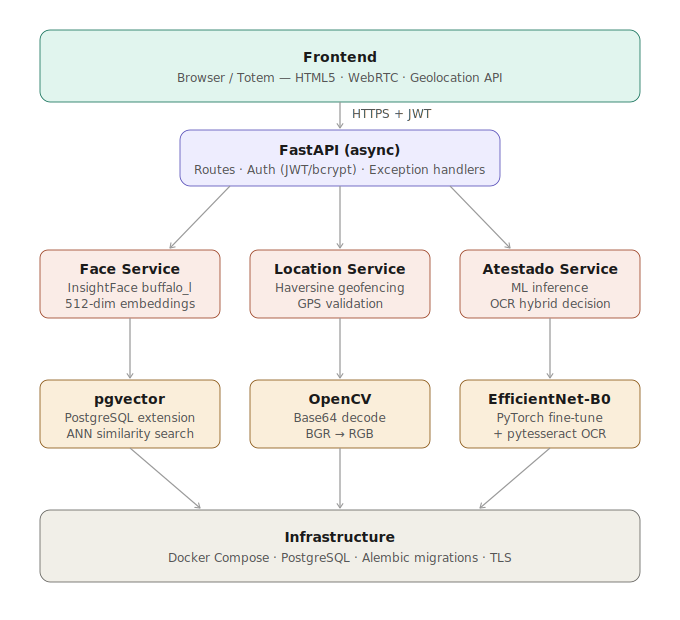

# Face Clock Evoluir

Sistema de registro de ponto com biometria facial, geofencing e classificação de atestados por deep learning.



---

## Stack Tecnológica

| Camada | Tecnologia | Papel |
| :--- | :--- | :--- |
| **Backend** | `Python 3.10+` / `FastAPI` | API assíncrona de alta performance |
| **Banco de Dados** | `PostgreSQL` + `pgvector` | Persistência relacional + busca vetorial de embeddings |
| **Migrações** | `Alembic` | Controle de schema incremental |
| **Reconhecimento Facial** | `InsightFace` (`buffalo_l`) | Extração de embeddings faciais de 512 dimensões |
| **Processamento de Imagem** | `OpenCV` | Decodificação e conversão de espaço de cor |
| **Deep Learning** | `PyTorch` + `torchvision` | Classificador de atestados via EfficientNet-B0 |
| **OCR** | `pytesseract` | Extração de texto como sinal complementar |
| **Frontend** | `HTML5 / JS` | Interface via WebRTC + Geolocation API |
| **Contêineres** | `Docker Compose` | Orquestração local do banco e serviços |

---

## Reconhecimento Facial e Embeddings

O sistema usa o modelo `buffalo_l` do InsightFace para gerar embeddings faciais normalizados de **512 dimensões**. Cada vetor extraído é um ponto no espaço $\mathbb{R}^{512}$ com norma unitária, o que permite comparar dois rostos via **similaridade de cosseno** diretamente pelo produto escalar:

$$
\text{similarity}(u, v) = u \cdot v = \sum_{i=1}^{512} u_i v_i
$$

Como ambos os vetores são normalizados (`normed_embedding`), o produto escalar equivale ao cosseno do ângulo entre eles — sem necessidade de divisão explícita pela norma. O limiar de aceitação é `0.5` (equivalente a ~60° de abertura angular). Valores acima indicam correspondência.

### Fluxo de verificação

```
Imagem (bytes)
    │
    ▼
cv2.imdecode → BGR → RGB
    │
    ▼
InsightFace buffalo_l
    │  detecta faces (exige exatamente 1)
    ▼
normed_embedding  →  vetor float32 [512]
    │
    ▼
np.dot(embedding_cadastrado, embedding_atual)
    │
    ├── score >= 0.5  →  ACEITO
    └── score < 0.5   →  RECUSADO
```

Os embeddings são validados antes de qualquer comparação: dimensões devem ser iguais, o vetor não pode conter `NaN`/`Inf`, e a norma deve ser ≈ 1.0 (tolerância `1e-3`).

Os vetores são persistidos no PostgreSQL usando a extensão **pgvector**, o que permite consultas de vizinhança no futuro (ex.: ANN search).

---

## Classificador de Atestados (PyTorch / EfficientNet-B0)

O módulo `app/ml` contém um pipeline completo de fine-tuning para classificar imagens de documentos médicos (atestado / não-atestado).

### Arquitetura do modelo

`AtestadoClassifier` é uma EfficientNet-B0 pré-treinada no ImageNet (`IMAGENET1K_V1`) com fine-tuning seletivo:

```
EfficientNet-B0
├── features[0..6]   →  congelados (pesos ImageNet mantidos)
├── features[7]      →  desbloqueado para gradientes  (lr = 1e-4)
├── features[8]      →  desbloqueado para gradientes  (lr = 1e-4)
└── classifier
    ├── Dropout(0.3)
    └── Linear(1280 → num_classes)  (lr = 3e-4)
```

O backbone tem ~5.3 M parâmetros, dos quais apenas os dos dois últimos blocos de features e o classificador são treináveis por padrão. O método `unfreeze_from(block)` permite descongelar blocos adicionais progressivamente.

### Pipeline de treinamento

O script `app/ml/pipelines/train_model.py` suporta três modos:

| Modo | Descrição |
| :--- | :--- |
| `normal` | Train/val splits fixos com `WeightedRandomSampler` |
| `cross_validation` | Stratified K-Fold (padrão: 10 folds) |
| `bayes` | Otimização de hiperparâmetros via Optuna (TPE sampler) |

```bash
python -m app.ml.pipelines.train_model normal
python -m app.ml.pipelines.train_model cross_validation --folds 10
python -m app.ml.pipelines.train_model bayes --trials 30 --bayes-epochs 10
```

### Configuração de treinamento (`MLConfig`)

| Parâmetro | Valor |
| :--- | :--- |
| Dispositivo | CUDA se disponível, senão CPU |
| Batch size | 32 |
| Epochs | 100 (com early stopping, patience=20) |
| LR classificador | 3e-4 |
| LR backbone (features[7-8]) | 1e-4 |
| Weight decay | 1e-4 |
| Label smoothing | 0.1 |
| Scheduler | `CosineAnnealingWarmRestarts` (T₀=10, T_mult=2) |
| Mixed Precision | AMP habilitado com CUDA |
| Gradient clipping | norma máxima 1.0 |

### Augmentações de treino

```python
Resize(256) → RandomCrop(224)
RandomRotation(±15°)
RandomPerspective(distortion=0.3, p=0.4)
RandomAffine(translate=5%, scale=0.9–1.1, shear=5°)
ColorJitter(brightness=0.4, contrast=0.4, saturation=0.1)
RandomGrayscale(p=0.2)
GaussianBlur(kernel=3, p=0.3)
RandomHorizontalFlip(p=0.3)
Normalize(mean=[0.485, 0.456, 0.406], std=[0.229, 0.224, 0.225])
```

### Decisão final (CNN + OCR)

Na inferência, a predição da CNN pode ser complementada por OCR (`pytesseract`). A função `decide_with_ocr` combina a confiança da CNN com sinais textuais extraídos do documento para produzir a decisão final, com rastreabilidade da fonte (`cnn_only`, `ocr_override`, etc.).

---

## Segurança

- Tráfego protegido via **HTTPS (TLS)**
- Autenticação por **JWT** em todas as rotas protegidas
- Senhas com **bcrypt** (passlib)
- Embeddings faciais tratados como dados sensíveis (LGPD): não são reversíveis e não expõem a imagem original

---

## Geofencing (Haversine)

$$
d = 2r \arcsin\left(\sqrt{\sin^2\!\left(\frac{\Delta\phi}{2}\right) + \cos\phi_1\cos\phi_2\sin^2\!\left(\frac{\Delta\lambda}{2}\right)}\right)
$$

A validação de localização é feita no serviço `location_service.py` usando a fórmula de Haversine.

---

## Estrutura do Projeto

```
Face-Clock-Evoluir/
│
├── app/
│   ├── api/
│   │   └── routes/
│   │       ├── admin.py          # Gestão administrativa
│   │       ├── atestado.py       # Upload e consulta de atestados
│   │       ├── auth.py           # Login, logout, reset de senha
│   │       ├── banco_horas.py    # Banco de horas
│   │       ├── clock.py          # Registro de ponto (batida com biometria)
│   │       ├── me.py             # Perfil do usuário autenticado
│   │       ├── totem.py          # Endpoints do totem físico
│   │       └── users.py          # CRUD de usuários
│   │
│   ├── auth/
│   │   ├── dependencies.py       # FastAPI Depends de autenticação
│   │   ├── email.py              # Envio de e-mails (SMTP)
│   │   ├── jwt.py                # Geração/validação de tokens JWT
│   │   ├── passwords.py          # bcrypt hash/verify
│   │   ├── schemas.py            # Pydantic schemas de auth
│   │   └── service.py            # Lógica de autenticação
│   │
│   ├── core/
│   │   ├── config.py             # Settings via pydantic-settings
│   │   ├── database.py           # Engine + session SQLAlchemy (async)
│   │   ├── exception_handlers.py # Handlers globais de erro
│   │   └── logging.py            # Configuração de logging
│   │
│   ├── exceptions/
│   │   ├── face_detection.py     # FaceDetectionError e subtipos
│   │   ├── location.py           # LocationError
│   │   └── user.py               # UserError
│   │
│   ├── frontend/
│   │   ├── totem.html            # Interface do totem (WebRTC + GPS)
│   │   ├── dashboard.html        # Dashboard do gestor
│   │   ├── funcionarios.html     # Listagem de funcionários
│   │   ├── atestado.html         # Envio e consulta de atestados
│   │   ├── banco-de-horas.html   # Visualização de banco de horas
│   │   ├── meu-perfil.html       # Perfil e cadastro de face
│   │   ├── login.html            # Tela de login
│   │   ├── post-login.html       # Redirecionamento pós-login
│   │   └── reset-password.html   # Redefinição de senha
│   │
│   ├── ml/                       # Pipeline de ML (atestados)
│   │   ├── config.py             # MLConfig (hiperparâmetros, paths, device)
│   │   ├── transforms.py         # Augmentações torchvision (train/val)
│   │   ├── models/
│   │   │   └── atestado_classifier.py   # EfficientNet-B0 fine-tuning
│   │   ├── datasets/
│   │   │   └── atestado_dataset.py      # Dataset customizado
│   │   ├── training/
│   │   │   └── engine.py                # train_epoch / validate_epoch
│   │   ├── pipelines/
│   │   │   ├── train_model.py           # CLI: normal / cross_validation / bayes
│   │   │   └── evaluate_model.py        # Avaliação com métricas
│   │   ├── inference/
│   │   │   └── predictor.py             # Inferência em imagem individual
│   │   ├── ocr/
│   │   │   └── atestado_ocr.py          # OCR pytesseract + decisão híbrida
│   │   ├── evaluation/
│   │   │   └── evaluate_model.py        # Scripts de avaliação
│   │   ├── evaluation_results/          # Métricas e matriz de confusão
│   │   ├── logs/                        # Histórico de treinamento (JSON)
│   │   ├── data/
│   │   │   ├── train/                   # Dataset de treino (ImageFolder)
│   │   │   └── test/                    # Dataset de teste
│   │   └── requirements-ml.txt          # Dependências exclusivas do módulo ML
│   │
│   ├── ml_service/
│   │   └── main.py               # Microsserviço ML separado (FastAPI)
│   │
│   ├── models/
│   │   ├── user.py               # SQLAlchemy: User (embedding pgvector)
│   │   ├── atestado.py           # SQLAlchemy: Atestado
│   │   ├── movimentacao.py       # SQLAlchemy: MovimentacaoBanco
│   │   └── totem.py              # SQLAlchemy: Totem
│   │
│   ├── repositories/
│   │   └── user_repository.py    # Queries de usuário (pgvector search)
│   │
│   ├── schemas/
│   │   ├── user_schema.py
│   │   ├── clock_schema.py
│   │   ├── atestado_schema.py
│   │   ├── banco_horas_schema.py
│   │   └── totem_schema.py
│   │
│   ├── services/
│   │   ├── face_service.py       # InsightFace: extração e comparação de embeddings
│   │   ├── clock_service.py      # Lógica de registro de ponto
│   │   ├── atestado_service.py   # Lógica de atestados + inferência ML
│   │   ├── dataset_service.py    # Adição de amostras ao dataset de treino
│   │   └── location_service.py  # Geofencing (Haversine)
│   │
│   ├── utils/
│   │   └── utils_functions.py
│   │
│   └── main.py                   # Entrypoint FastAPI
│
├── alembic/                      # Migrações de banco
│   └── versions/
│
├── scripts/                      # Utilitários de desenvolvimento
│   ├── create_test_user.py
│   ├── manage_users.py
│   ├── seed_clock_users.py
│   └── split_dataset.py
│
├── tests/
│   ├── test_clock_punch.py
│   ├── test_atestado_route.py
│   ├── test_location.py
│   └── test_add_user_script.py
│
├── docker-compose.yml
├── alembic.ini
├── requirements.txt              # Dependências de produção
└── .env
```

---

## Fluxo de Registro de Ponto

```
Usuário (totem/browser)
    │  POST /clock  { imagem_base64, latitude, longitude }
    ▼
[1] JWT validation          →  identifica user_id
[2] Base64 decode           →  bytes da imagem
[3] FaceService.extract_embedding()
        InsightFace buffalo_l → vetor float32[512]
[4] FaceService.compare_faces()
        np.dot(embedding_db, embedding_atual)
        score >= 0.5 → face_ok
[5] LocationService.validate()
        Haversine(coords_user, coords_empresa)
        distância <= raio → location_ok
[6] face_ok AND location_ok → registra batida
[7] Persistência: movimentacao + timestamp + score
```

---

## Como Executar

```bash
# 1. Subir o banco de dados
docker compose up -d

# 2. Aplicar migrações
alembic upgrade head

# 3. Iniciar a API
uvicorn app.main:app --reload

# 4. Treinar o classificador de atestados
python -m app.ml.pipelines.train_model normal
```
